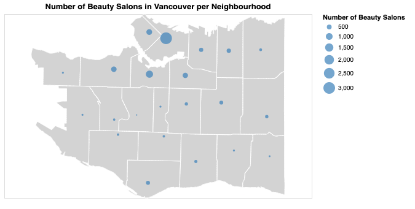

# Forecasting-the-Evolution-of-Vancouver-s-Business-Landscape

Analysis is found [here](https://github.com/EitharAlfatih/Introduction-to-Vancouver-s-Business-Landscape)

### About the Analysis
This analysis was motivated by my interest in understanding the Business Ecosystem in Vancouver. The main objective is classify the buisnesses into 15 main catogories and then see how the number of new registered businesses have changed over time.

### About the Dataset

- The dataset used in this work can be found in The City of Vancouver Open Data Protal [here](https://opendata.vancouver.ca/explore/dataset/business-licences/information/?disjunctive.status&disjunctive.businesssubtype). 
- Data for Vancouver map was found in also in The City of Vancouver Open Data Protal [here](https://maps.vancouver.ca/portal/apps/sites/#/vanmap/items/dc9c6b18f9054bfb96a22d552248dbda)

### Methods and packages used

- Data preprocessing was done using Python `Pandas` package.
- Textual data for business types was preprocessed using Python `Spacy` and `NLTK` packages.
- Topic Modeling was applied to find the main 15 Business types using `Gensim ` Package.
- All data visualization was done in `Altair`.

### Example Map from the Analysis

